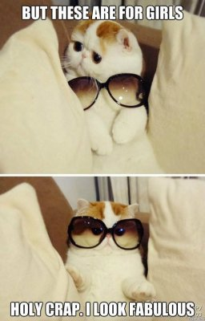

# cefet-web-unicorns

Uma página web **fabulosa** contando a origem, os mitos e a verdade sobre os unicórnios.

## Atividade

Um _web designer_ criou a parte artística de uma página  web usando seu programa de edição de imagens predileto (_e.g._, Photoshop) e lhe entregou dois arquivos (<abbr title="Comprehensive Layout">comp</abbr>: `unicorns-comp.png`, <abbr title="Specifications">specs</abbr>: `unicorns-specs.png`) para que você crie a página propriamente dita, usando html e css.

Você deve estilizar a página (`index.html`) de forma a fazê-la exatamente igual ao que o _web designer_ vislumbrou.

## Desafios

1. Tente estilizar a margem dos parágrafos usando seletores que não são de classes/IDs
1. Faça sua página ser **_pixel-perfect_** com os _specs_, ou seja, a página tem que seguir exatamente o que foi proposto
1. Decore a letra da música até o final da aula e vamos todos cantar \o/ ;)
